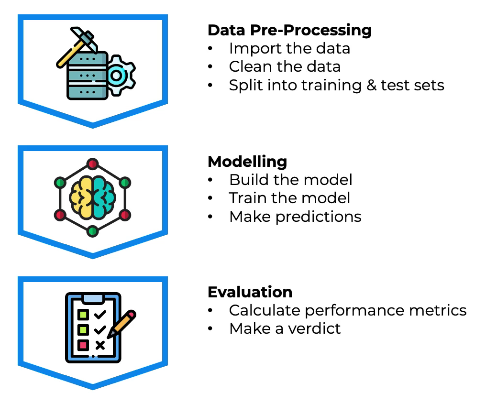
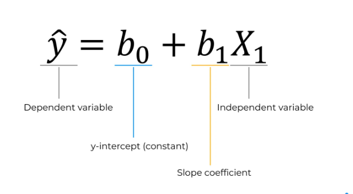
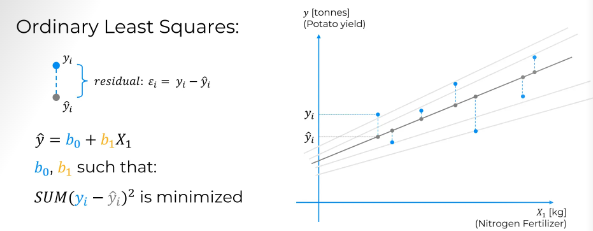
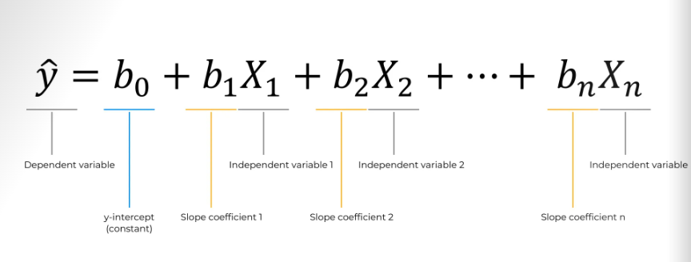

# Part-1: Data Preprocessing
## Machine Learning workflow

## Training and Test Split in Model Evaluation
- Training Set : Used to build the model
- Test Set : Used to check predicted vs actual values

- Dependent Variable(y): The one column that is dependent on others. Usually the one that needs to be predicted.
- Independent Variable(x): The column that is independent.

## Feature Scaling
- Always applied to columns.
- There are two types of feature scaling:
    - Normalization:
        1. X'=(X-Xmin)/(Xmax-Xmin)
        2. X' -> [0,1]
    - Standardization
        1. X'=(X-μ)/σ
        2. x' -> [-3,3]

# Part-2:Regression
Regression models (both linear and non-linear) are used for predicting a real value, like salary for example. If your independent variable is time, then you are forecasting future values, otherwise your model is predicting present but unknown values. Regression technique vary from Linear Regression to SVR and Random Forests Regression.

In this part, you will understand and learn how to implement the following Machine Learning Regression models:

    1. Simple Linear Regression
    2. Multiple Linear Regression
    3. Polynomial Regression
    4. Support Vector for Regression (SVR)
    5. Decision Tree Regression
    6. Random Forest Regression

## 1.Simple Linear Regression

### Understanding the equation

### Understanding Ordinary Least Squares Regression

## 2.Multiple Linear Regression
### Understanding the equation

### Link for course slides 
Link for [course slides](https://online.fliphtml5.com/grdgl/hfrm/#p=12) here.
Get your datasets, codes, and slides [here](https://www.superdatascience.com/machine-learning)