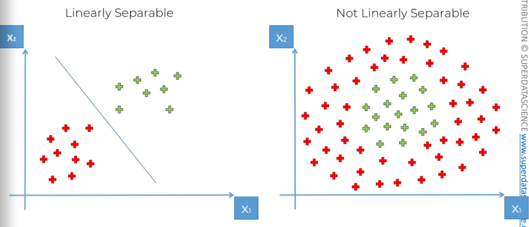
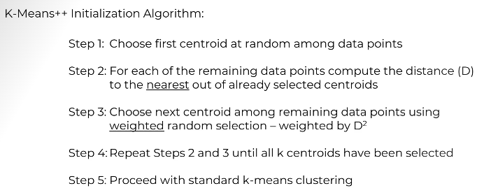

# Part-1: Data Preprocessing

## 1. Machine Learning workflow


## 2. Training and Test Split in Model Evaluation

- Training Set : Used to build the model
- Test Set : Used to check predicted vs actual values

- Dependent Variable(y): The one column that is dependent on others. Usually the one that needs to be predicted.
- Independent Variable(x): The column that is independent.

## 3. Feature Scaling

- Always applied to columns.
- There are two types of feature scaling:
  - Normalization:
        1. X'=(X-Xmin)/(Xmax-Xmin)
        2. X' -> [0,1]
  - Standardization
        1. X'=(X-μ)/σ
        2. x' -> [-3,3]

# Part-2 : Regression (Supervised Learning)

Regression models (both linear and non-linear) are used for predicting a real value, like salary for example. If your independent variable is time, then you are forecasting future values, otherwise your model is predicting present but unknown values. Regression technique vary from Linear Regression to SVR and Random Forests Regression.

In this part, you will understand and learn how to implement the following Machine Learning Regression models:

    1. Simple Linear Regression
    2. Multiple Linear Regression
    3. Polynomial Regression
    4. Support Vector for Regression (SVR)
    5. Decision Tree Regression
    6. Random Forest Regression

## 1. Simple Linear Regression

### 1. Understanding the equation


### 2. Understanding Ordinary Least Squares Regression


## 2. Multiple Linear Regression

NOTE : We dont need to perform feature scaling in mlr as it is autobalanced itself.

### 1. Understanding the equation


### 2. Understanding Linear Regression Assumptions: Linearity, Homoscedasticity


### 3. How to handle categorical data in Linear Regression?


### 4. Multi co linearity in linear regression


### 5. Building Robust Multiple Regression Models

NOTE:

- Backward Elimination is irrelevant in Python, because the Scikit-Learn library automatically takes care of selecting the statistically significant features when training the model to make accurate predictions.
- However, if you do really want to learn how to manually implement Backward Elimination in Python and identify the most statistically significant features, please find in this link below some old videos I made on how to implement Backward Elimination in Python:
[click here](https://www.dropbox.com/sh/pknk0g9yu4z06u7/AADSTzieYEMfs1HHxKHt9j1ba?dl=0)

- These are old videos made on Spyder but the dataset and the code are the same as in the previous video lectures of this section on Multiple Linear Regression, except that I had manually removed the first column to avoid the Dummy Variable Trap with this line of code:

```
# Avoiding the Dummy Variable Trap
X = X[:, 1:]
```

- Just keep this for this Backward Elimination implementation, but keep in mind that in general you don't have to remove manually a dummy variable column because Scikit-Learn takes care of it.

- And also, please find the whole code implementing this Backward Elimination technique:

```
# Multiple Linear Regression
 
# Importing the libraries
import numpy as np
import matplotlib.pyplot as plt
import pandas as pd
 
# Importing the dataset
dataset = pd.read_csv('50_Startups.csv')
X = dataset.iloc[:, :-1].values
y = dataset.iloc[:, -1].values
print(X)
 
# Encoding categorical data
from sklearn.compose import ColumnTransformer
from sklearn.preprocessing import OneHotEncoder
ct = ColumnTransformer(transformers=[('encoder', OneHotEncoder(), [3])], remainder='passthrough')
X = np.array(ct.fit_transform(X))
print(X)
 
# Avoiding the Dummy Variable Trap
X = X[:, 1:]
 
# Splitting the dataset into the Training set and Test set
from sklearn.model_selection import train_test_split
X_train, X_test, y_train, y_test = train_test_split(X, y, test_size = 0.2, random_state = 0)
 
# Training the Multiple Linear Regression model on the Training set
from sklearn.linear_model import LinearRegression
regressor = LinearRegression()
regressor.fit(X_train, y_train)
 
# Predicting the Test set results
y_pred = regressor.predict(X_test)
np.set_printoptions(precision=2)
print(np.concatenate((y_pred.reshape(len(y_pred),1), y_test.reshape(len(y_test),1)),1))
 
# Building the optimal model using Backward Elimination
import statsmodels.api as sm
X = np.append(arr = np.ones((50, 1)).astype(int), values = X, axis = 1)
X_opt = X[:, [0, 1, 2, 3, 4, 5]]
X_opt = X_opt.astype(np.float64)
regressor_OLS = sm.OLS(endog = y, exog = X_opt).fit()
regressor_OLS.summary()X_opt = X[:, [0, 1, 3, 4, 5]]
X_opt = X_opt.astype(np.float64)
regressor_OLS = sm.OLS(endog = y, exog = X_opt).fit()
regressor_OLS.summary()X_opt = X[:, [0, 3, 4, 5]]
X_opt = X_opt.astype(np.float64)
regressor_OLS = sm.OLS(endog = y, exog = X_opt).fit()
regressor_OLS.summary()X_opt = X[:, [0, 3, 5]]
X_opt = X_opt.astype(np.float64)
regressor_OLS = sm.OLS(endog = y, exog = X_opt).fit()
regressor_OLS.summary()X_opt = X[:, [0, 3]]
X_opt = X_opt.astype(np.float64)regressor_OLS = sm.OLS(endog = y, exog = X_opt).fit()
regressor_OLS.summary()
Once again, this is totally optional.
```

- 5 methods of building models:

- All in
    
- Backward elimination
    
- Forward Selevtion
    
- Bidirectional Elimination
    
- All possible models
    

## 3. Polynomial Regression

### 1. Understanding the equation


## 4. Support Vector Regression (SVR)

### 1. Intuition behind SVR


### 2. Heads Up about non-linear SVR

- will be covered further down the course. (Section 18)
- Read about SVM Kernel Functions [here.](https://data-flair.training/blogs/svm-kernel-functions/#)

## 5. Decision Tree Regression

### 1. Decision Tree Intuition


## 6. Random Forest Regression

### 1.Random Forest Intuition and Application


#### Points to note

- **Ensemble Learning** : When you take multiple/same algorithm multiple times and put them together to make something much more powerful.

- doesn't work well wtih simple datasets with few attributes

## 7. Evaluating Regression Models Performance

### 1. R-squared


### 2. Adjusted R-Squared


## 7. Regression Model Selection in Python


- after trying all the algorithms and getting r2 score, we get that the random forest has the highest r2 score and hence it is the best model to use for the dataset.

# Part-3 : Classification (Supervised Learning)

- Unlike regression where you predict a continuous number, you use classification to predict a category. There is a wide variety of classification applications from medicine to marketing. Classification models include linear models like Logistic Regression, SVM, and nonlinear ones like K-NN, Kernel SVM and Random Forests.

- In this part, you will understand and learn how to implement the following Machine Learning Classification models:
    1. Logistic Regression
    2. K-Nearest Neighbors (K-NN)
    3. Support Vector Machine (SVM)
    4. Kernel SVM
    5. Naive Bayes
    6. Decision Tree Classification
    7. Random Forest Classification

## 1. Logistic Regression

### 1. Understanding Logistic Regression


### 2. Finding Best Fit Curve using Maximum Likelihood


## 2. k Nearest Neighbours


## 3. Support Vector Machines(SVMs)

### 1. Intuition


### 2. Why it didnt beat knn?

Since kNN is not a linear classifier whereas SVM is a linear classifier, hence, the data can be more accurately predicted using kNN because of no hyperplane to satisfy.

## 4. Kernel SVM

### 1. Why do we use kernel SVMs?



### 2. Mapping to a higher dimension


### 3. How kernel SVMs work


#### Drawback

- Mapping to a higher dimension is highly compute-intensive, we can solve this using kernel trick.


### 4. Kernel SVM Working with Trick


### 5. Types of Kernel Functions


### 6. NonLinear SVR


## 5. Naive Bayes Theorem

### 1. Bayes Theorem


### 2. Naive Bayes Classifier

#### Steps


#### Why naive?

-Independence assumption

#### Additional Comments


## 6. Decision Trees

### 1. Intuition


### 2. Comments on DT


## 7. Random Forest (ensemble learning)


## 8.Classification Model Selection

### Confusion matrix and Accuracy

- False Positives: The predictions that are false but shown as true by our model (type I Error- warning)
- False Negatives: The predictions that are true but shown as false by our model (type II Error- dangerous)

**Confusion Matrix and Accuracy** <br/>


- Accuracy Paradox: Sometimes the accuracy paints the wrong picture, example if the accuracy rate of one model is 98% and other is 98.5%, we would think 98.5% would be more accurate but when we see false negatives(the most dangerous type of error) then we get to know that 98% accuracy model is better than 98.5% model with lesser Fals negatives. This is called accuracy paradox.

### CAP Analysis

- CAP: Cumulative Accuracy Profile


## 9. Evaluating Classification Algorithms

- Deploy the dataseton all the models and calculate accuracy and check confusion matrix.
- Choose the best model with highest accuracy and lowest False Negatives.

# Part-4 : Clustering (Unsupervised Learning)

- Clustering is similar to classification, but the basis is different.
- In Clustering you don’t know what you are looking for, and you are trying to identify some segments or clusters in your data. When you use clustering algorithms on your dataset, unexpected things can suddenly pop up like structures, clusters and groupings you would have never thought of otherwise.

## 1. k-Means Clustering

### Methods to find number of Clusters needed

#### 1. Elbow Method

- Find WCSS for number of clusters.<br/>

- Plot the graph for WCSS(within clusters sum of squares) vs number of clusters.
- Find the kink(optimal number of clusters) and that is the number of clusters you should use.

#### 2. k-Means++

- Random Initialization Trap: In k means clustering, the centroids are taken randomly and that could lead to uncertain and in accurate clusters.
- Hence, we use k-means++ to find optimal centroids that can give us accurate results using weighted random selection.


## 2. Hierarchial Clustering

### 1. Agglomerative Clustering (bottom up approach)


#### Distance between two clusters


#### How do dendrograms work?


- How to choose how many clusters?<br/>Plot the graph of dendro gram between euclidean distances and data points and look for largest vertical lines/ highest euclidean distances between data points and divide them there. You have to set your threshhold for that and you would get your desired clusters.

### 2. Divisive Clustering(top down approach)

# Part-5 : Association Rule Learning

- People who bought also bought ... That is what Association Rule Learning will help us figure out!

## 1. Apriori

- Consists of three components:
    1. Support
    

    2. Confidence
    

    3. Lift
    

### Algorithm


## 2. Eclat


### Algorithm


# Part-6: Reinforcement Learning

- Reinforcement Learning is a powerful branch of Machine Learning.
- It is used to solve interacting problems where the data observed up to time t is considered to decide which action to take at time t + 1. It is also used for Artificial Intelligence when training machines to perform tasks such as walking.
- Desired outcomes provide the AI with reward, undesired with punishment. Machines learn through trial and error.

## 1. Upper Confidence Bound (UCB)

### 1. Multi Armed bandit Problem

- The slot machine is called one armed bandit. It is called multi armed when there is a set of slot machines.
- The question is to play the games in order to maximize returns. Each has its own distribution of probability of success.

#### Question


## 2. Thompson Sampling

## Link for course slides

### 1. Bayesian Inference


### 2. Algorithm


- We have generated our own bandit configuration.


Link for [course slides](https://online.fliphtml5.com/grdgl/hfrm/#p=12) here.
Get your datasets, codes, and slides [here](https://www.superdatascience.com/machine-learning)
