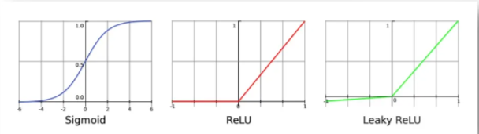
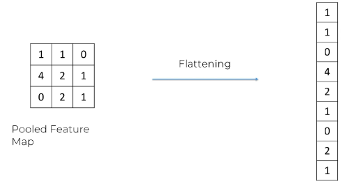
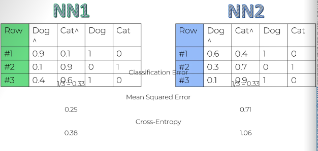

**Q. What is the difference between ai, ml, deeplearning and data science?**


# Part-1: Data Preprocessing

## 1. Machine Learning workflow


## 2. Training and Test Split in Model Evaluation

- Training Set : Used to build the model
- Test Set : Used to check predicted vs actual values

- Dependent Variable(y): The one column that is dependent on others. Usually the one that needs to be predicted.
- Independent Variable(x): The column that is independent.

## 3. Feature Scaling

- Always applied to columns.
- There are two types of feature scaling:
  - Normalization:
        1. X'=(X-Xmin)/(Xmax-Xmin)
        2. X' -> [0,1]
  - Standardization
        1. X'=(X-μ)/σ
        2. x' -> [-3,3]

---

# Part-2 : Regression (Supervised Learning)

Regression models (both linear and non-linear) are used for predicting a real value, like salary for example. If your independent variable is time, then you are forecasting future values, otherwise your model is predicting present but unknown values. Regression technique vary from Linear Regression to SVR and Random Forests Regression.

In this part, you will understand and learn how to implement the following Machine Learning Regression models:

    1. Simple Linear Regression
    2. Multiple Linear Regression
    3. Polynomial Regression
    4. Support Vector for Regression (SVR)
    5. Decision Tree Regression
    6. Random Forest Regression

## 1. Simple Linear Regression

### 1. Understanding the equation


### 2. Understanding Ordinary Least Squares Regression


## 2. Multiple Linear Regression

NOTE : We dont need to perform feature scaling in mlr as it is autobalanced itself.

### 1. Understanding the equation


### 2. Understanding Linear Regression Assumptions: Linearity, Homoscedasticity


### 3. How to handle categorical data in Linear Regression?


### 4. Multi co linearity in linear regression


### 5. Building Robust Multiple Regression Models

NOTE:

- Backward Elimination is irrelevant in Python, because the Scikit-Learn library automatically takes care of selecting the statistically significant features when training the model to make accurate predictions.
- However, if you do really want to learn how to manually implement Backward Elimination in Python and identify the most statistically significant features, please find in this link below some old videos I made on how to implement Backward Elimination in Python:
[click here](https://www.dropbox.com/sh/pknk0g9yu4z06u7/AADSTzieYEMfs1HHxKHt9j1ba?dl=0)

- These are old videos made on Spyder but the dataset and the code are the same as in the previous video lectures of this section on Multiple Linear Regression, except that I had manually removed the first column to avoid the Dummy Variable Trap with this line of code:

```
# Avoiding the Dummy Variable Trap
X = X[:, 1:]
```

- Just keep this for this Backward Elimination implementation, but keep in mind that in general you don't have to remove manually a dummy variable column because Scikit-Learn takes care of it.

- And also, please find the whole code implementing this Backward Elimination technique:

```
# Multiple Linear Regression
 
# Importing the libraries
import numpy as np
import matplotlib.pyplot as plt
import pandas as pd
 
# Importing the dataset
dataset = pd.read_csv('50_Startups.csv')
X = dataset.iloc[:, :-1].values
y = dataset.iloc[:, -1].values
print(X)
 
# Encoding categorical data
from sklearn.compose import ColumnTransformer
from sklearn.preprocessing import OneHotEncoder
ct = ColumnTransformer(transformers=[('encoder', OneHotEncoder(), [3])], remainder='passthrough')
X = np.array(ct.fit_transform(X))
print(X)
 
# Avoiding the Dummy Variable Trap
X = X[:, 1:]
 
# Splitting the dataset into the Training set and Test set
from sklearn.model_selection import train_test_split
X_train, X_test, y_train, y_test = train_test_split(X, y, test_size = 0.2, random_state = 0)
 
# Training the Multiple Linear Regression model on the Training set
from sklearn.linear_model import LinearRegression
regressor = LinearRegression()
regressor.fit(X_train, y_train)
 
# Predicting the Test set results
y_pred = regressor.predict(X_test)
np.set_printoptions(precision=2)
print(np.concatenate((y_pred.reshape(len(y_pred),1), y_test.reshape(len(y_test),1)),1))
 
# Building the optimal model using Backward Elimination
import statsmodels.api as sm
X = np.append(arr = np.ones((50, 1)).astype(int), values = X, axis = 1)
X_opt = X[:, [0, 1, 2, 3, 4, 5]]
X_opt = X_opt.astype(np.float64)
regressor_OLS = sm.OLS(endog = y, exog = X_opt).fit()
regressor_OLS.summary()X_opt = X[:, [0, 1, 3, 4, 5]]
X_opt = X_opt.astype(np.float64)
regressor_OLS = sm.OLS(endog = y, exog = X_opt).fit()
regressor_OLS.summary()X_opt = X[:, [0, 3, 4, 5]]
X_opt = X_opt.astype(np.float64)
regressor_OLS = sm.OLS(endog = y, exog = X_opt).fit()
regressor_OLS.summary()X_opt = X[:, [0, 3, 5]]
X_opt = X_opt.astype(np.float64)
regressor_OLS = sm.OLS(endog = y, exog = X_opt).fit()
regressor_OLS.summary()X_opt = X[:, [0, 3]]
X_opt = X_opt.astype(np.float64)regressor_OLS = sm.OLS(endog = y, exog = X_opt).fit()
regressor_OLS.summary()
Once again, this is totally optional.
```

- 5 methods of building models:

- All in<br/>
    
- Backward elimination<br/>
    
- Forward Selection<br/>
    
- Bidirectional Elimination<br/>
    
- All possible models<br/>
    

## 3. Polynomial Regression

### 1. Understanding the equation


## 4. Support Vector Regression (SVR)

### 1. Intuition behind SVR


### 2. Heads Up about non-linear SVR

- will be covered further down the course. (Section 18)
- Read about SVM Kernel Functions [here.](https://data-flair.training/blogs/svm-kernel-functions/#)

## 5. Decision Tree Regression

### 1. Decision Tree Intuition


## 6. Random Forest Regression

### 1.Random Forest Intuition and Application


#### Points to note

- **Ensemble Learning** : When you take multiple/same algorithm multiple times and put them together to make something much more powerful.

- doesn't work well wtih simple datasets with few attributes

## 7. Evaluating Regression Models Performance

### 1. R-squared


### 2. Adjusted R-Squared


## 7. Regression Model Selection in Python

[Link](https://drive.google.com/open?id=1O8vabaxga3ITjCWfwD79Xnyf8RavYuyk)

- after trying all the algorithms and getting r2 score, we get that the random forest has the highest r2 score and hence it is the best model to use for the dataset.

---

# Part-3 : Classification (Supervised Learning)

- Unlike regression where you predict a continuous number, you use classification to predict a category. There is a wide variety of classification applications from medicine to marketing. Classification models include linear models like Logistic Regression, SVM, and nonlinear ones like K-NN, Kernel SVM and Random Forests.

- In this part, you will understand and learn how to implement the following Machine Learning Classification models:
    1. Logistic Regression
    2. K-Nearest Neighbors (K-NN)
    3. Support Vector Machine (SVM)
    4. Kernel SVM
    5. Naive Bayes
    6. Decision Tree Classification
    7. Random Forest Classification

## 1. Logistic Regression

### 1. Understanding Logistic Regression


### 2. Finding Best Fit Curve using Maximum Likelihood


## 2. k Nearest Neighbours


## 3. Support Vector Machines(SVMs)

### 1. Intuition


### 2. Why it didnt beat knn?

Since kNN is not a linear classifier whereas SVM is a linear classifier, hence, the data can be more accurately predicted using kNN because of no hyperplane to satisfy.

## 4. Kernel SVM

### 1. Why do we use kernel SVMs?


### 2. Mapping to a higher dimension


### 3. How kernel SVMs work


#### Drawback

- Mapping to a higher dimension is highly compute-intensive, we can solve this using kernel trick.


### 4. Kernel SVM Working with Trick


### 5. Types of Kernel Functions


### 6. NonLinear SVR


## 5. Naive Bayes Theorem

### 1. Bayes Theorem


### 2. Naive Bayes Classifier

#### Steps


#### Why naive?

-Independence assumption

#### Additional Comments


## 6. Decision Trees

### 1. Intuition


### 2. Comments on DT


## 7. Random Forest (ensemble learning)


## 8.Classification Model Selection

### Confusion matrix and Accuracy

- False Positives: The predictions that are false but shown as true by our model (type I Error- warning)
- False Negatives: The predictions that are true but shown as false by our model (type II Error- dangerous)

**Confusion Matrix and Accuracy** <br/>


- Accuracy Paradox: Sometimes the accuracy paints the wrong picture, example if the accuracy rate of one model is 98% and other is 98.5%, we would think 98.5% would be more accurate but when we see false negatives(the most dangerous type of error) then we get to know that 98% accuracy model is better than 98.5% model with lesser Fals negatives. This is called accuracy paradox.

### CAP Analysis

- CAP: Cumulative Accuracy Profile <br/>
<br/>


## 9. Evaluating Classification Algorithms

- Deploy the dataseton all the models and calculate accuracy and check confusion matrix.
- Choose the best model with highest accuracy and lowest False Negatives.

---

# Part-4 : Clustering (Unsupervised Learning)

- Clustering is similar to classification, but the basis is different.
- In Clustering you don’t know what you are looking for, and you are trying to identify some segments or clusters in your data. When you use clustering algorithms on your dataset, unexpected things can suddenly pop up like structures, clusters and groupings you would have never thought of otherwise.

## 1. k-Means Clustering

### Methods to find number of Clusters needed

#### 1. Elbow Method

- Find WCSS for number of clusters.<br/>

- Plot the graph for WCSS(within clusters sum of squares) vs number of clusters.
- Find the kink(optimal number of clusters) and that is the number of clusters you should use.

#### 2. k-Means++

- Random Initialization Trap: In k means clustering, the centroids are taken randomly and that could lead to uncertain and in accurate clusters.
- Hence, we use k-means++ to find optimal centroids that can give us accurate results using weighted random selection.<br/>


## 2. Hierarchial Clustering

### 1. Agglomerative Clustering (bottom up approach)


#### Distance between two clusters


#### How do dendrograms work?


- How to choose how many clusters?<br/>Plot the graph of dendro gram between euclidean distances and data points and look for largest vertical lines/ highest euclidean distances between data points and divide them there. You have to set your threshhold for that and you would get your desired clusters.

### 2. Divisive Clustering(top down approach)

---

# Part-5 : Association Rule Learning

- People who bought also bought ... That is what Association Rule Learning will help us figure out!

## 1. Apriori

- Consists of three components:
    1. Support<br/>
    

    2. Confidence<br/>
    

    3. Lift<br/>
    

### Algorithm


## 2. Eclat


### Algorithm


---
<!-- TODO: Complete this section from the course  -->

# Part-6: Reinforcement Learning

- Reinforcement Learning is a powerful branch of Machine Learning.
- It is used to solve interacting problems where the data observed up to time t is considered to decide which action to take at time t + 1. It is also used for Artificial Intelligence when training machines to perform tasks such as walking.
- Desired outcomes provide the AI with reward, undesired with punishment. Machines learn through trial and error.

## 1. Upper Confidence Bound (UCB)

### 1. Multi Armed bandit Problem

- The slot machine is called one armed bandit. It is called multi armed when there is a set of slot machines.
- The question is to play the games in order to maximize returns. Each has its own distribution of probability of success.

#### Question


## 2. Thompson Sampling

### 1. Bayesian Inference


### 2. Algorithm


- We have generated our own bandit configuration.


---

# Part - 7: Natural Language Processing

- Natural Language  Processing (or NLP) is applying Machine Learning models to text and language. Teaching machines to understand what is said in spoken and written word is the focus of Natural Language Processing.
- Whenever you dictate something into your iPhone / Android device that is then converted to text, that’s an NLP algorithm in action. You can also use NLP on a text review to predict if the review is a good one or a bad one. You can use NLP on an article to predict some categories of the articles you are trying to segment. You can use NLP on a book to predict the genre of the book. And it can go further, you can use NLP to build a machine translator or a speech recognition system, and in that last example you use classification algorithms to classify language. Speaking of classification algorithms, most of NLP algorithms are classification models, and they include Logistic Regression, Naive Bayes, CART which is a model based on decision trees, Maximum Entropy again related to Decision Trees, Hidden Markov Models which are models based on Markov processes.
- A very well-known model in NLP is the Bag of Words model. It is a model used to preprocess the texts to classify before fitting the classification algorithms on the observations containing the texts.
- We will learn the following topics:<br/>


## 1. Types of NLP


## 2. Evolution of NLP

- Some Examples of NLP:
  - If/Else Rules (Chatbot)
  - Audio frequency component analysis (speech recognition)
  - Bag-of-words model (Classification)
- Some Examples of DNLP and Seq2Seq:
  - CNN for text Recognition (Classification)
  - Seq2Seq (many applications)

## 3. Bag-of-words Model (NLP)

<br/>

### 1. Working


### 2. Metrics to see the efficiency of the model

- Accuracy is not enough, so you should also look at other performance metrics like Precision (measuring exactness), Recall (measuring completeness) and the F1 Score (compromise between Precision and Recall).
- Please find below these metrics formulas (TP = # True Positives, TN = # True Negatives, FP = # False Positives, FN = # False Negatives):

    1. Accuracy = (TP + TN) / (TP + TN + FP + FN)

    2. Precision = TP / (TP + FP)

    3. Recall = TP / (TP + FN)

    4. F1 Score = 2 x Precision x Recall / (Precision + Recall)

- other classification models that we haven't covered in Part 3 - Classification. Good ones for NLP include:

    1. CART
    2. C5.0
    3. Maximum Entropy

---

# Part - 8: Deep Learning

- Deep Learning is the most exciting and powerful branch of Machine Learning. Deep Learning models can be used for a variety of complex tasks:
    1. Artificial Neural Networks for Regression and Classification
    2. Convolutional Neural Networks for Computer Vision
    3. Recurrent Neural Networks for Time Series Analysis
    4. Self Organizing Maps for Feature Extraction
    5. Deep Boltzmann Machines for Recommendation Systems
    6. Auto Encoders for Recommendation Systems
- **How it looks:**<br/>


## 1. Deep Learning Basics

### The natural neurons


### The artificial neuron


#### Activation Function Types

1. **Threshold Function**<br/>
    
2. **Sigmoid Function**<br/>

3. **Rectifier Function**<br/>

4. **Hyperbolic Tangent (tanh)** - similar to sigmoid but the values goes below 0 to -1.<br/>


- *Note: It is quite common to use rectifier function in hidden layers and the sigmoid function in the output layer.*

## 2. Deep Learning Fundamentals

### 1. Gradient Descent vs Brute Force optimization

- **Brute Force**: Trying all the combinations and finding an optimal solution might take billions of years to solve a problem.
- This is called `curse of dimensionality`.
- **Gradient Descent**: This reduces the problem space and helps us reach optimal solution faster.


#### 1. Batch Gradient Descent

- Works if our cost function is convex meaning theres a global minima that we have to reach and there are no local minimas present.
- We can find local minima and we might lose global goal minima. For that, we can use stochastic gradient descent.

#### 2.Stochastic Gradient Descent

- We take all the rows as a batch and then update cost function unlike stochastic gradient descent where we took each row and updated weights on by one.
- Way faster.

**Difference between Stochastic Gradient Descent and Batch Gradient Descent**


## 2. Artificial Neural Networks

### Training ANN with stochastic gradient descent


### How do neural networks work?


### How do neural networks learn?

- Goal is to minimize the cost function.
- Epoch : One epoch is when we go through the whole dataset and train our dataset once.


You can learn DL in detail [here](https://www.superdatascience.com/blogs/the-ultimate-guide-to-artificial-neural-networks-ann)

## 3. Convolutional Neural Networks


### Step-1 : Convolution

**Important Terms**

1. Stride : The pace at which the input image is analyzed.

<br/>
<br/>


### Step-1b : ReLU Layer

<br/>

- ReLU breaks linearity, this is important because the data in images is already very non linear and this helps us remove that.

#### Original Image

<br/>

#### After finding feature maps and getting covolutioned/ filtered image

- white =  positive values, black = negative values


#### After ReLU Image

- only non negative values.


#### Types of ReLU for CNN



### Step-2 : Max Pooling

- To have spatial invariance i.e. it doesnt care where the features are in the picture ,we use max pooling.
- Max pool is, in mxn matrix, there would be yxy filter that would input only the max value in that filter into the pooled feature map and give the output.


### Step-3 : Flattening

<br/>
<br/>

### Step-4 : Full Connection

- All the nodes are connected to each other and the inputs are passed using gradient descent methods and errors are backpropagated and adjusted just like ANNs and our model is made.
- Nodes in the last hidden layer get to do the voting and vote for the final decision.
- not only weights but feature detectors are also updated until we reach the optimal stage.


### Step-5: Softmax and Cross Entropy in CNNs (Optional)

#### Softmax Function

- For example, if we want the predictions of whether it is a dog or a cat to add upto 1, that wont happen without softmax function. Softmax helps us bring these values between 0 to 1 and add up to 1.<br/>


#### Cross Entropy Function

- This is used for evaluating our CNN model.
- Remember that we used cross entropy in ANN we used Mean Squared Cost function, in CNN, we can still use it but the cross entropy function works better with images.
- The advantages of Cross Entropy over MSE is:
    1. Helps network assess even a small error so that it is not stuck in the first iteration unlike it can be the case in MSE because of the help og the log function. MSE wont be guided with enough power in the right direction.
    2. Better for classification tasks and better way to get to optimal state. Not good for regression.


#### Evaluating Efficiency

    1. **Classification Error** - not a good measure for backpropagation.
    2. **Mean Squared Error** - Better Metric
    3. **Cross Entropy** - Even better



### Summary

Get the compiled notes [here](https://www.superdatascience.com/blogs/the-ultimate-guide-to-convolutional-neural-networks-cnn)


---

# Part - 9 : Dimensionality Reduction

- Whatever is the original number of our independent variables, we can often end up with two independent variables by applying an appropriate Dimensionality Reduction technique.

- There are two types of Dimensionality Reduction techniques:
    1. Feature Selection
    2. Feature Extraction

- Feature Selection techniques are Backward Elimination, Forward Selection, Bidirectional Elimination, Score Comparison and more. We covered these techniques in Part 2 - Regression.

- We will cover the following Feature Extraction techniques:

    1. Principal Component Analysis (PCA)

    2. Linear Discriminant Analysis (LDA)

    3. Kernel PCA

## 1. Principal Component Analysis - PCA

**Goal**: Maximize variance (unsupervised)

**Type**: Unsupervised dimensionality reduction

**How it works**: Finds directions (principal components) that capture the maximum variance in the data.

**Use case**: Useful when you want to compress data or remove noise without labels.

**Assumption**: Data is linearly separable.

**Example**: Reducing image data from 1000 pixels to 50 features by capturing the most "variation" in the image.

### Intuition

- Most used dimensionality reduction algorithm.

- Usecases - noise filtering, visualization, feature extraction, stock market predictions, gene data analysis
- Goal of PCA:
    1. Identify patterns in data
    2. Detect the correlation between variables
    => reduce the dimensions of a d-dimensional dataset by projecting it onto a (k)- dimensional subspace where (k<d)
- Main functions of PCA:
    1. Standardize the data
    2. Obtain the eigenvctors and eigenvalues from the covariance matrix or correltation matrix, or perform singular vector decomposition.
    3. sort eigen values in descending order and choose the k eigen vectors that correspond to the k largest eigenvalues where k is the number of dimensions of the new feature subspace.
    4. Construct the projection matrix `W` from the selected k eighen vectors.
    5. Transform the original dataset X via W to obtain a k-dimesnional feature subspace Y.

for visualisation [visit here.](https://setosa.io/ev/principal-component-analysis/)

## 2. Linear Discriminant Analysis (LDA)

**Goal**: Maximize class separability (supervised)

**Type**: Supervised dimensionality reduction

**How it works**: Projects data onto a lower-dimensional space that maximizes the separation between multiple classes.

**Use case**: Used in classification problems to improve model performance.

**Assumption**: Data has class labels and is linearly separable.

**Example**: Given images labeled "cat" and "dog", LDA finds features that best separate those two classes.

### Intuition

- Similarities with PCA:
  - Used as a dimensionality reduction technique.
  - Used in the pre-processing step for pattern classification
  - Has the goal to project a dataset onto a lower dimensional space
- How it is different from PCA:
  - LDA differs because in addition to finding the component axises with LDA, we are interested in the axes that minimize the separation between multiple classes.
  - Basically, it is used to project a feature space onto a small subspace while maintaining the class discriminatory information.
  - PCA is unsupervised but LDA is supervised because of the relation to the dependent variable.

## 3. Kernel PCA

**Goal**: Capture non-linear relationships

**Type**: Unsupervised, non-linear dimensionality reduction

**How it works**: Uses kernel functions (like RBF or polynomial) to map data to a higher-dimensional space where linear PCA is then applied.

**Use case**: When data isn't linearly separable, Kernel PCA can capture complex patterns.

**Example**: For a spiral-shaped dataset (non-linear), Kernel PCA can unravel it into a line.

## Summary

| Feature            | PCA                                 | LDA                                 | Kernel PCA                    |
| ------------------ | ----------------------------------- | ----------------------------------- | ----------------------------- |
| Supervision        | Unsupervised                        | Supervised                          | Unsupervised                  |
| Linearity          | Linear                              | Linear                              | Non-linear                    |
| Goal               | Maximize variance                   | Maximize class separability         | Capture non-linear structures |
| Needs class labels | ❌ No                                | ✅ Yes                               | ❌ No                          |
| Best for           | Feature extraction, noise reduction | Classification, supervised learning | Non-linear feature extraction |

---

# Part - 10 : Model Selection and Boosting

## 1. Model Selection

***These questions remained unanswered till now, this section will help us answer them**

1. How to deal with the bias variance tradeoff when building a model and evaluating its performance ?
2. How to choose the optimal values for the hyperparameters (the parameters that are not learned) ?
3. How to find the most appropriate Machine Learning model for my business problem ?

**These solutions would help us answer them :**

1. k-Fold Cross Validation
2. Grid Search

- Finally, we will complete the course with one of the most powerful Machine Learning model, that has become more and more popular: XGBoost.

### 1. K-Fold Cross Validation Technique


#### Bias Variance Tradeoff


### 2. Grid SearchCV

GridSearchCV is a hyperparameter tuning technique in machine learning provided by scikit-learn. It helps you find the best combination of hyperparameters for a model to improve its performance.

#### What It Does

- Exhaustively searches through a specified grid of hyperparameters.

- Trains and evaluates your model for each combination of hyperparameters using cross-validation.

- Returns the best parameters and the model with the best performance.

## 2. Boosting - XGBoost

- Best model both for regression and classification.

### Key Features of XGBoost

- Feature Explanation
- Regularization Prevents overfitting by penalizing complex trees.
- Parallel Processing Trains trees using multiple cores of the CPU.
- Tree Pruning Uses a smarter pruning algorithm ("max depth" or "best-first") for efficient trees.
- Handling Missing Values Automatically learns the best direction to go when data is missing.
- Built-in Cross-validation Has built-in CV functions to tune parameters efficiently.

### Why Use XGBoost?

- High accuracy

- Faster training

- Handles missing values

- Great with tabular datasets

- Wide adoption in Kaggle competitions and real-world projects

---

## Link for course slides

Link for [course slides](https://online.fliphtml5.com/grdgl/hfrm/#p=12) here.
Get your datasets, codes, and slides [here](https://www.superdatascience.com/machine-learning)
---
